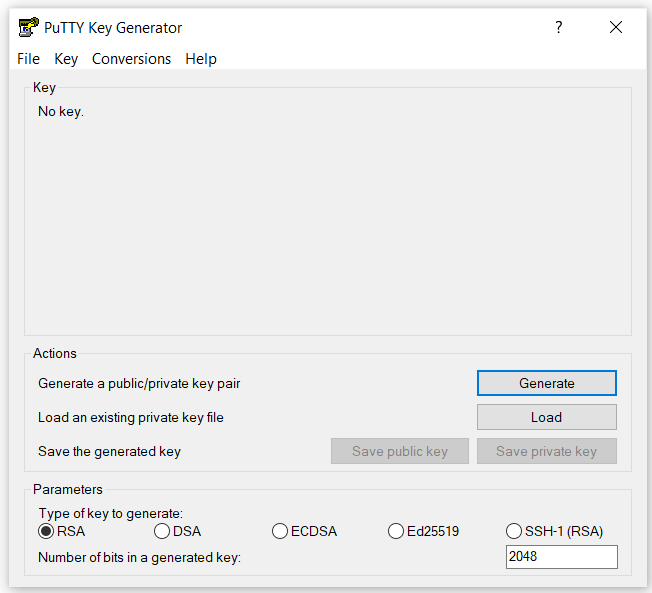
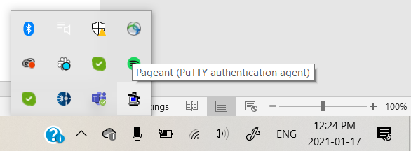
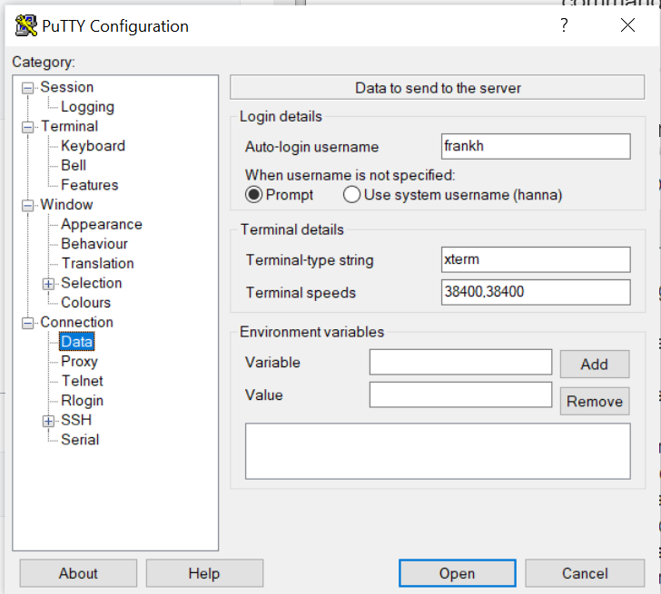
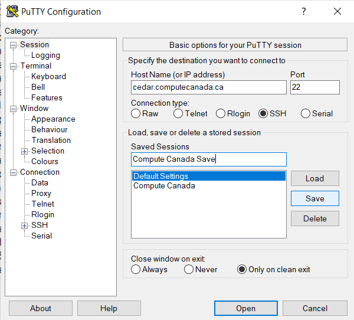

```{r setup, include=FALSE}
knitr::opts_chunk$set(echo = TRUE)
```

## Connecting to the Compute Canada Westgrid Servers

There are several ways to connect depending on what system you are using. This tutorial will show one way this can be done on a Windows system and provide resources for other options.

#### Step 1: Generate SSH keys 
SSH (Secure Shell) is an encrypted connection used to connect to remote servers securely. It uses key pairs to enable remote servers to authenticate those attempting to connect to it, without users having to enter their username and password all the time. Do not share these keys with anyone.  
In order to generate a key pair on Windows, you will need to download an SSH client such as [PuTTY](https://www.chiark.greenend.org.uk/~sgtatham/putty/).  


- Click the "Generate" button and move your mouse around on the window to generate random data. 

You should now see something like this in your PuTTYgen window:  


- Enter a passphrase for your key. Remember this passphrase as you will need it later.
- Click the "Save private key" button and choose a meaningful file name and location. Remember where you save this file as you will need this location later.

Do NOT yet close the PuTTYgen window. 

Open a PuTTY window and start a session on compute canada's cedar cluster by entering "cedar.computecanada.ca" as the host name, and making sure the port is set to 22 and SSH is selected as the connection type (do not worry about saving a session for now - we will get to this later):  


Click "Open". You should now see a terminal asking for your Compute Canada username and password:


After you log in, you should see something like this:


Now we need to save the public key that you generated with your private key in PuTTYgen earlier. Go back to your PuTTYgen window and copy the whole string in the field "Public key for pasting into OpenSSH authorized_keys file", starting with "ssh-rsa". 
Go back to your PuTTY terminal and enter the following commands line by line, pasting in the public key you copied from PuTTYgen (in order to paste, you should be able to right click at the appropriate spot in the PuTTY terminal to paste):
```
mkdir ~/.ssh
echo (PASTE YOUR PUBLIC KEY HERE) >> ~/.ssh/authorized_keys
chmod --recursive go-rwx ~/.ssh
chmod go-w ~
```

These commands save your public key to the remote server and make sure your remote home directory and `.ssh` directory are  not writable by other users.
You can check that your key has been successfully saved to the server by running:
```
cat ~/.ssh/authorized_keys
```

#### Step 2: Open a connection to the server
Firstly, in your windows search bar, search for and open `Pageant`. It will not open a window, only start running on your computer in the background. 
In the bottom of right of the screen, you should now see the icon for Pageant (you may need to click on the arrow to expand the running programs). Right click on this icon and select `add key`:



This will open a file browser. Navigate to the location of your saved private key and click `Open`. You will be prompted to enter the passphrase you chose for this key. You will now not need to enter this passphrase each time you start a new Compute Canada session. 

Start PuTTY (not PuTTYgen) - and fill in the host name again as below:  


Expand the "SSH" tab under "Connection" in the left panel and then click on "Auth". Enter the file path to where you stored your private SSH key in the "Private key file for authentication" box at the bottom:


Next, go to `Data` under the `Connection` tab and enter your Compute Canada username in the `Auto-login username` field under `Login details`:


Go back to the `Session` tab, enter a name for these settings under `Saved Sessions` and click `Save`. Next time you want to start a Compute Canada session, you can select this saved session from the list and click `Load`. 


Finally, click `Open`. You should not be prompted to enter your username and login, it should complete that authentication automatically now. If it worked, you should see something like this:


