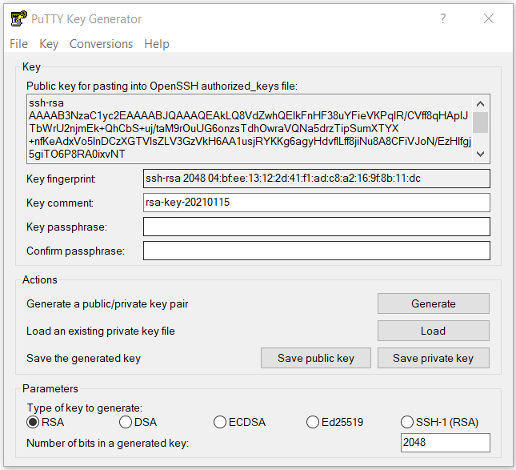

```{r setup, include=FALSE}
knitr::opts_chunk$set(echo = TRUE)
```

## Connecting to the Compute Canada Westgrid Servers

There are several ways to connect depending on what system you are using. This tutorial will show one way this can be done on a Windows system and provide resources for other options.

#### Step 1: Generate SSH keys 
SSH (Secure Shell) is an encrypted connection used to connect to remote servers securely. In order to generate a key pair on Windows, you will need to download an SSH client such as [PuTTY](https://www.chiark.greenend.org.uk/~sgtatham/putty/).


- Click the "Generate" button and move your mouse around on the window to generate random data. 
- Enter a passphrase for your key. 
- Click the "Save private key" button and choose a meaningful file name.

You should now see something like this in your PuTTYgen window:


- Copy the public key in the box at the top (under "Public key for pasting into OpenSSH authorized_keys file:") 