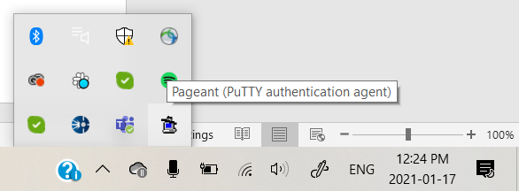
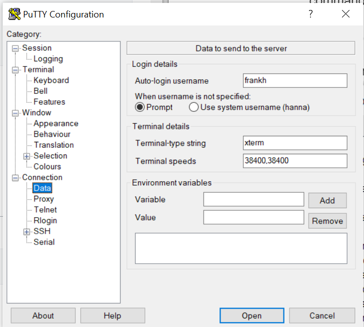
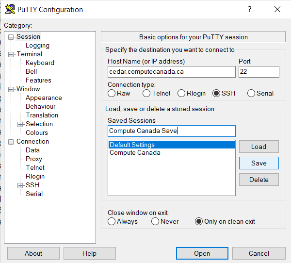
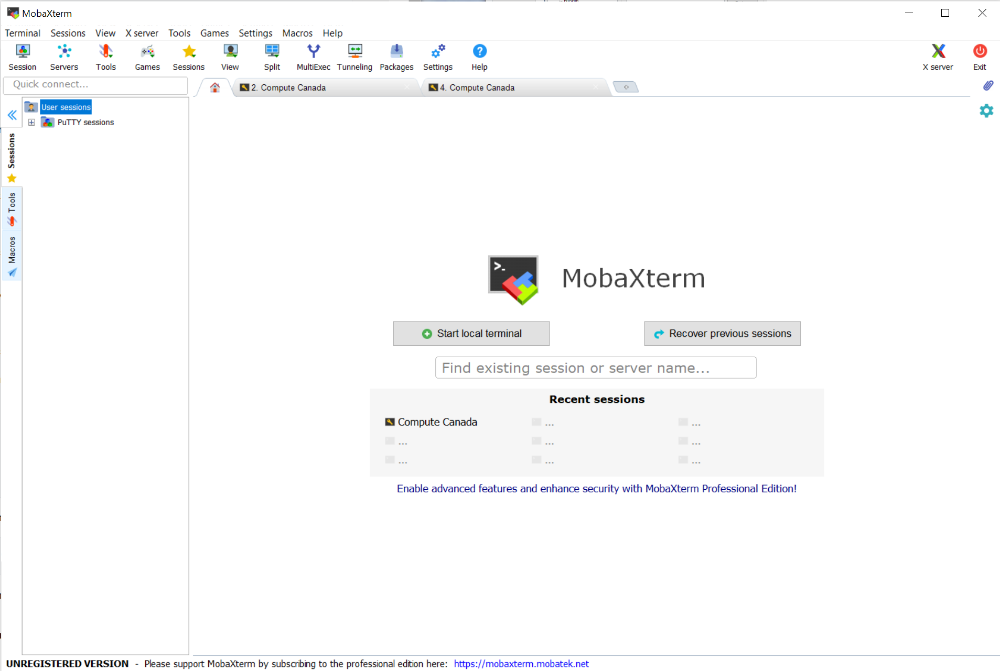
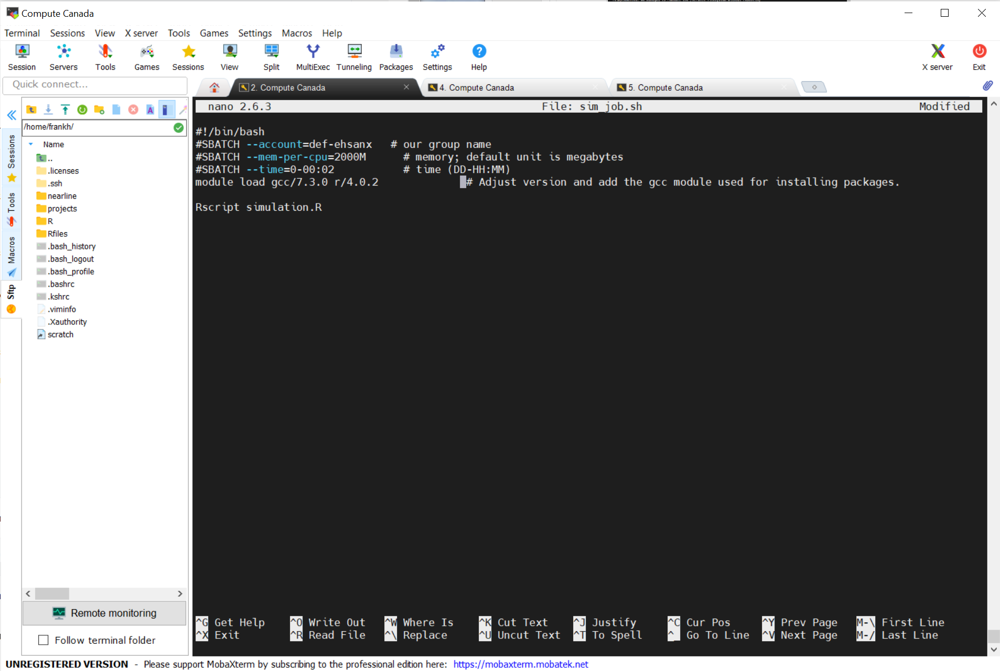
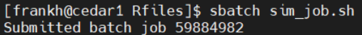
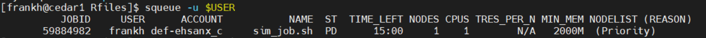

Compute Canada Tutorial
================
Hanna Frank
15/01/2021

## Connecting to the Compute Canada Westgrid Servers

There are several ways to connect depending on what system you are
using. This tutorial will show one way this can be done on a Windows
system and provide resources for other options.

#### Step 1: Generate SSH keys

SSH (Secure Shell) is an encrypted connection used to connect to remote
servers securely. It uses key pairs to enable remote servers to
authenticate those attempting to connect to it, without users having to
enter their username and password all the time. Do not share these keys
with anyone.  
In order to generate a key pair on Windows, you will need to download an
SSH client such as
[PuTTY](https://www.chiark.greenend.org.uk/~sgtatham/putty/).  

  - Click the “Generate” button and move your mouse around on the window
    to generate random data.

You should now see something like this in your PuTTYgen window:  

  - Enter a passphrase for your key. Remember this passphrase as you
    will need it later.
  - Click the “Save private key” button and choose a meaningful file
    name and location. Remember where you save this file as you will
    need this location later.

Do NOT yet close the PuTTYgen window.

Open a PuTTY window and start a session on compute canada’s cedar
cluster by entering “cedar.computecanada.ca” as the host name, and
making sure the port is set to 22 and SSH is selected as the connection
type (do not worry about saving a session for now - we will get to this
later):  

Click “Open”. You should now see a terminal asking for your Compute
Canada username and password: 

After you log in, you should see something like this: 

Now we need to save the public key that you generated with your private
key in PuTTYgen earlier. Go back to your PuTTYgen window and copy the
whole string in the field “Public key for pasting into OpenSSH
authorized\_keys file”, starting with “ssh-rsa”. Go back to your PuTTY
terminal and enter the following commands line by line, pasting in the
public key you copied from PuTTYgen (in order to paste, you should be
able to right click at the appropriate spot in the PuTTY terminal to
paste):

    mkdir ~/.ssh
    echo (PASTE YOUR PUBLIC KEY HERE) >> ~/.ssh/authorized_keys
    chmod --recursive go-rwx ~/.ssh
    chmod go-w ~

These commands save your public key to the remote server and make sure
your remote home directory and `.ssh` directory are not writable by
other users. You can check that your key has been successfully saved to
the server by running:

    cat ~/.ssh/authorized_keys

#### Step 2: Open a connection to the server

Firstly, in your windows search bar, search for and open `Pageant`. It
will not open a window, only start running on your computer in the
background. In the bottom of right of the screen, you should now see the
icon for Pageant (you may need to click on the arrow to expand the
running programs). Right click on this icon and select `add key`:
 

This will open a file browser. Navigate to the location of your saved
private key and click `Open`. You will be prompted to enter the
passphrase you chose for this key. You will now not need to enter this
passphrase each time you start a new Compute Canada session.

Start PuTTY (not PuTTYgen) - and fill in the host name again as below:  

Expand the “SSH” tab under “Connection” in the left panel and then click
on “Auth”. Enter the file path to where you stored your private SSH key
in the “Private key file for authentication” box at the bottom: 

Next, go to `Data` under the `Connection` tab and enter your Compute
Canada username in the `Auto-login username` field under `Login
details`:  

Go back to the `Session` tab, enter a name for these settings under
`Saved Sessions` and click `Save`. Next time you want to start a Compute
Canada session, you can select this saved session from the list and
click `Load`. 

Finally, click `Open`. You should not be prompted to enter your username
and login, it should complete that authentication automatically now. If
it worked, you should see something like this: 

#### Step 3: Run a job on the server

In this tutorial I will be going through how to submit a simple job to
execute an R script.

The first step is to transfer all the necessary files over to the
server. In order to do this we will use the
[MobaXterm](https://mobaxterm.mobatek.net/download.html) interface.
Download MobaXterm and open the program.

On the left under `User sessions`, you should see `PuTTY sessions`.
Expand this and double-click on your Compute Canada Session. 

You should now see the file structure on your Compute Canada server
account on the left side. Navigate into the `scratch` folder as this is
where we will submit the job from. Then click the `upload to current
folder` button (the up arrow above your files) and select and upload all
the files you will need for your job. If you have a job script (`.sh`
file) already, upload this as well. You can put all these files into a
subdirectory if you wish. 

Next, you need to set up your R environment on the server. You will do
this in the terminal open in `MobaXterm`. Begin by loading an R module -
there will be several versions available which you can see a list of
using the command:  
`module spider r`  
To load your selected version of R (for example 4.0.2), run  
`module load gcc/7.3.0 r/4.0.2`

You can now run R interactively by just typing the command `R`, which
will essentially be like an R console. This is also where you will
install any packages you require for the script you want to run, by
running `install.packages("<package name>")` just as you would in R
Studio. To exit this interactive R session run the command `q()`.

Now you need to create your job script, if you have not done so. In
order to do this straight from the `MobaXterm` terminal, run `nano` or
open another text editor in the terminal. Then write your job script in
this file, save (ctrl + o in nano), specifying a file name with a `.sh`
extension (type file name & hit enter), and exit (ctrl + x in nano). A
simple example of a job executing an R Script is given below:

The same code is given below in a copy-and-paste-able fashion, so you
can adapt it for your needs:

    #!/bin/bash
    #SBATCH --account=def-ehsanx   # our group name
    #SBATCH --mem-per-cpu=2000M      # memory; default unit is megabytes
    #SBATCH --time=0-00:02           # time (DD-HH:MM)
    module load gcc/7.3.0 r/4.0.2              # Adjust version and add the gcc module used for installing packages.
    
    Rscript simulation.R

To submit this job, you can run  
`sbatch <job filename>`  
At which point you should see something like:  

You can check the status of your job by running  
`squeue -u $USER`  
which should show something like:  

Output from your job should be found in whatever directory your job
script was in, in a file called `slurm-<job number>.out`. This file will
have any console output that you included in the script you ran. If you
saved any files from within your R script, you can find these by
following the path you saved them to from whatever directory your job
script was in.
