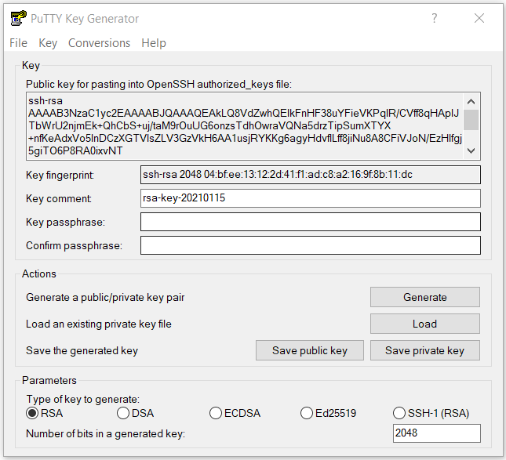
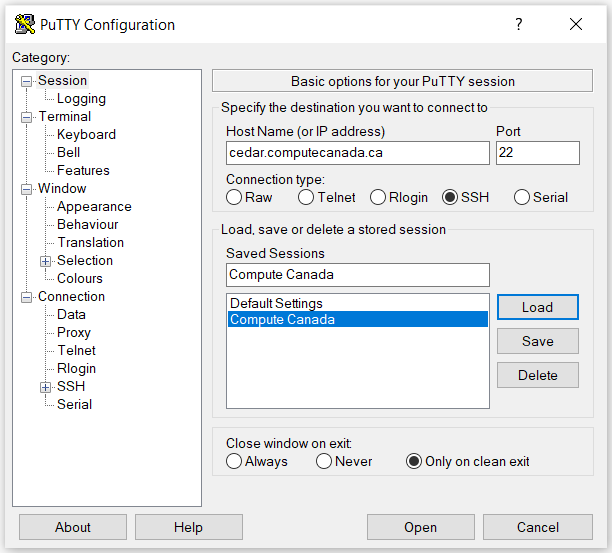
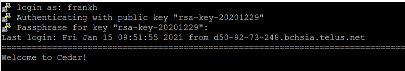

Compute Canada Tutorial
================
Hanna Frank
15/01/2021

## Connecting to the Compute Canada Westgrid Servers

There are several ways to connect depending on what system you are
using. This tutorial will show one way this can be done on a Windows
system and provide resources for other options.

#### Step 1: Generate SSH keys

SSH (Secure Shell) is an encrypted connection used to connect to remote
servers securely. In order to generate a key pair on Windows, you will
need to download an SSH client such as
[PuTTY](https://www.chiark.greenend.org.uk/~sgtatham/putty/).  

  - Click the “Generate” button and move your mouse around on the window
    to generate random data.
  - Enter a passphrase for your key.
  - Click the “Save private key” button and choose a meaningful file
    name.

You should now see something like this in your PuTTYgen window:  

  - Copy the public key in the box at the top (under “Public key for
    pasting into OpenSSH authorized\_keys file:”) and add the key to the
    end of /home/USERNAME/.ssh/authorized\_keys on the server you want
    to connect to (—– TO DO: add commands to do this here, don’t quite
    remember how I did it anymore will have to go back through it ——-)

#### Step 2: Open a connection to the server

Start PuTTY (not PuTTYgen) - and fill in the host name as below:  

Expand the “SSH” tab under “Connection” in the left panel and then click
on “Auth”. Enter the file path to where you stored your private SSH key
in the “Private key file for authentication” box at the bottom. Next,
click “Open” and enter your Compute Canada username and the passphrase
you chose for your SSH key when prompted. You should see something like
this in the terminal if your login was successful:  

